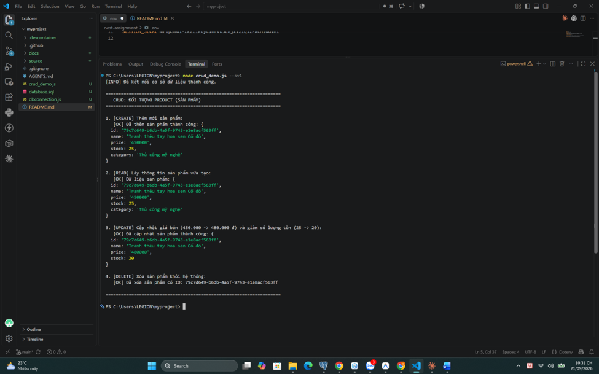
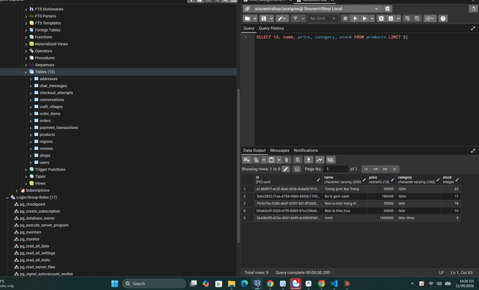
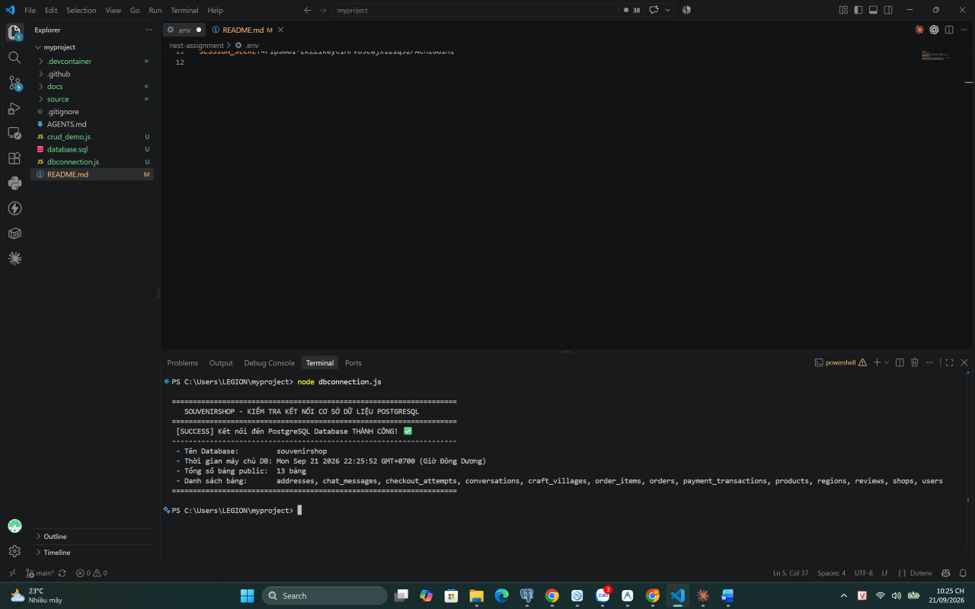

# BÁO CÁO BÀI TẬP NHÓM - THIẾT KẾ WEB NÂNG CAO

## 1. Thông tin chung & Thành viên nhóm

- **Tên đề tài:** SouvenirShop - Nền tảng Marketplace quà lưu niệm Việt Nam
- **Link Git Repo:** [https://github.com/MinhDq113jqk/thietkewednangcao](https://github.com/MinhDq113jqk/thietkewednangcao)
- **Danh sách thành viên & Phân công CRUD:**

| STT | Họ và tên | MSSV | GitHub Username | Đối tượng phụ trách CRUD | Trách nhiệm chính |
| :---: | :--- | :---: | :---: | :---: | :--- |
| 1 | Dương Quang Minh | 23010567 | `MinhDq113jqk` | **Product** (Sản phẩm) | Khởi tạo repo, cấu hình `.devcontainer`, CRUD Sản phẩm |


# Giới thiệu dự án SouvenirShop

SouvenirShop là marketplace quà lưu niệm Việt Nam dành cho người mua trong và ngoài nước, đồng thời cung cấp kênh bán hàng cho hộ gia đình, làng nghề, cá nhân sáng tạo và xưởng sản xuất.

## Chức năng chính

- Khám phá, tìm kiếm, lọc và xem chi tiết sản phẩm theo gian hàng.
- Gợi ý sản phẩm kết hợp sở thích danh mục ẩn danh, sản phẩm đang xem, lịch sử mua và độ phổ biến.
- Giỏ hàng, COD, VietQR và chống tạo đơn lặp bằng `Idempotency-Key`.
- Theo dõi trạng thái, hãng vận chuyển, mã vận đơn, vị trí hiện tại và lịch sử hành trình.
- Tài khoản người mua, sổ địa chỉ và đổi mật khẩu.
- Kênh người bán quản lý sản phẩm, đơn hàng, giao vận, gian hàng và doanh thu.
- Kênh quản trị duyệt gian hàng, quản lý người dùng và đơn hàng.


## Chạy local

Yêu cầu: Node.js, npm và PostgreSQL.

Các lệnh mã nguồn chạy từ thư mục `source/`:

1. Cài dependencies:

```powershell
cd source
npm.cmd install
npm.cmd --prefix backend install
```

2. Tạo cấu hình backend:

```powershell
Copy-Item backend\.env.example backend\.env
node -e "console.log(require('crypto').randomBytes(48).toString('base64url'))"
```

Chạy lệnh sinh chuỗi hai lần và đặt hai giá trị khác nhau vào `JWT_SECRET` và `JWT_REFRESH_SECRET` trong `source\backend\.env`. Cập nhật `DATABASE_URL` theo PostgreSQL local. Không commit file `.env`.

3. Khởi tạo database:

```powershell
npm.cmd --prefix backend run migrate
npm.cmd --prefix backend run seed
```

`seed` dùng `SEED_ACCOUNT_PASSWORD` từ môi trường; nếu chưa đặt, script tạo mật khẩu ngẫu nhiên và chỉ in một lần trong terminal local.

4. Mở hai terminal:

```powershell
cd source
npm.cmd --prefix backend run dev
```

```powershell
cd source
npm.cmd run dev
```

Truy cập `http://127.0.0.1:5173`. API chạy tại `http://localhost:3000`; kiểm tra nhanh bằng `http://localhost:3000/health`.

## Kiểm tra chất lượng

```powershell
cd source
npm.cmd test
npm.cmd run lint
npm.cmd run build
npm.cmd --prefix backend run smoke:core
```



